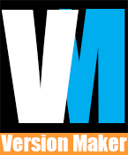

A repository to create versions of any type of asset.

This is designed to be used with arbitrary projects however its initially designed for film.

# Instructions

# DCC Application integration
- For creation via a DCC you should create a sub directory to the application folder.

# Structure
- All folder structures should be saved to a folder in constants
- eg: 'Film' has a directory with a hierarchy.py file
- hierarchy.py files with define path structure in a project

# Examples

## Maya Alembic Export

Here we import AnimationFilmPublish and set all the necessary/recommended settings to export.

<pre><code>
import versionMaker.application.maya.export.animation
afp = versionMaker.application.maya.export.animation.AnimationFilmPublish()
afp.show_folder_location="D:/Google Drive/Projects"
afp.show_folder = "sol"
afp.partition="3D"
afp.division="sequences"
afp.sequence="SF"
afp.shot="0010"
afp.task="layout"
afp.asset="ni"
afp.message="testing publish"
afp.start_frame=1013
afp.end_frame=1013
afp()
</code></pre>